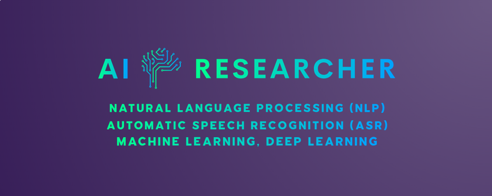

<!-- Adaptive GitHub Profile README for Muhammad Qasim -->
<picture>
  <!-- Dark mode banner -->
  <source media="(prefers-color-scheme: dark)" srcset="images/research-banner.png">
  <!-- Light mode banner -->
  <source media="(prefers-color-scheme: light)" srcset="images/research-banner.png">
  
</picture>

<!--- 

  
  
  

--->

---

## Muhammad Qasim  
**Natural Language Processing Engineer | AI Researcher**  
[🌐 Profile Website](https://mqacim.github.io)

---

### 🧠 Research Interests
Speech and Language Processing • Automatic Speech Recognition (ASR) • Multilingual NLP • Speech Emotion Recognition • AI for Accessibility

---

### 💼 Work Experience

**Natural Language Processing Engineer — [Quarrio](https://www.quarrio.com/)**  
*Sep 2016 – Present*  
Developing deterministic semantic AI: multi-level parsers and grammars that allow natural English queries on structured data. Enables contextual understanding and clarifications for non-technical users.

**Research Associate — Center for Language Engineering, UET Lahore**  
*Dec 2014 – Sep 2016*  
Built Urdu ASR and dialogue systems. Deployed weather helpline handling 23,997 calls in 10 months with ~96.3% success.

---

### 🎓 Education

**MS, Computer Engineering** — UET Lahore  

**B.Sc, Electrical Engineering** — UET Lahore  

---

### ⚙️ Tools & Frameworks

---

> _© Muhammad Qasim — Last updated: Oct 2025_  
<!--- > _This README automatically switches between light and dark themes based on your browser or GitHub settings._
